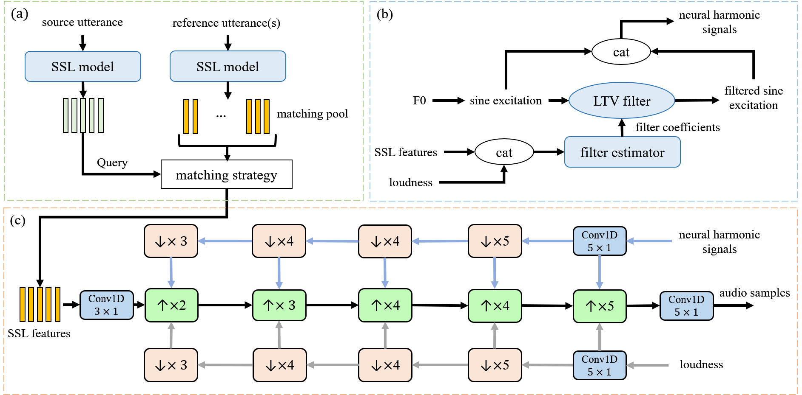

# Neural Concatenative Singing Voice Conversion

<a href='https://thuhcsi.github.io/NeuCoSVC/'></a> 
<a href='https://arxiv.org/abs/2312.04919'></a>
[](https://github.com/thuhcsi/NeuCoSVC)

This is the official implementation of NeuCoSVC, an any-to-any singing voice conversion model from our [paper](https://arxiv.org/abs/2312.04919).
Audio samples are available at [https://thuhcsi.github.io/NeuCoSVC/](https://thuhcsi.github.io/NeuCoSVC/). The trained checkpoints are available from [google drive](https://drive.google.com/file/d/1QjoQ6mt7-OZPHF4X20TXbikYdg8NlepR/view?usp=drive_link).



Figure: The structure of the proposed SVC system: (a) the SSL feature extracting and matching module; (b) the neural harmonic signal generator; (c) the audio synthesizer.

## Setup

### Environment

We recommend installing the project's environment using Anaconda. The `requirements.txt` file contains a curated list of dependencies for the developing environment(Torch 2.0.1 + cu117). You can use the following commands to set up the environment:

```bash
conda create -n NeuCoSVC python=3.10.6
conda activate NeuCoSVC
pip install -r requirements.txt
```

Additionally, you can find the complete original environment used for developing in the `requirements_all.txt` file.

Besides, [REAPER](https://github.com/google/REAPER) is required for pitch extraction. You need to download and build *reaper*, and then modify the path to *reaper* in the 60th line of [utils/pitch_ld_extraction.py](utils/pitch_ld_extraction.py)

### Checkpoints

The checkpoint for the frozen WavLM Large encoder can be obtained from the [original WavLM repository](https://github.com/microsoft/unilm/tree/master/wavlm). 

The trained FastSVC model with neural harmonic filters can be downloaded from [google drive](https://drive.google.com/file/d/1QjoQ6mt7-OZPHF4X20TXbikYdg8NlepR/view?usp=drive_link)

Then you need to put the WavLM-Large.pt file and model.pkl folder in the `pretrained` folder.

## Inference

Note that the source waveform must be 24kHz. `--speech_enroll` is recommended when using speech as the reference audio, and the pitch of the reference audio will be increased to 1.2 times when performing a pitch shift to cover the pitch gap between singing and speech.

```bash
python infer.py --src_wav_path src-wav-path --ref_wav_path ref-wav-path --out_path out-path --speech_enroll
```

## Training

### Data Preparation

Take the OpenSinger dataset as an example, the dataset needs to be **resampled to 24kHz**. 

```
- OpenSinger_24k
    |- ManRaw/
    |   | - SingerID_SongName/
    |   |   | - SingerID_SongName_SongClipNumber.wav/
    |   |   | - ...
    |   | - ...
    |- WomanRaw/
    |   | - 0_光年之外/
    |   |   | - 0_光年之外_0.wav/ 
    |   |   | - ...
    |   | - ...
```

Then perform data preprocessing.

1. Extract pitch and loudness. Specify the directories for pitch and loudness using the `--pitch_dir` and `--ld_dir` parameters respectively. If not specified, the features will be saved in the `pitch`/`loudness` folder under the `dataset-root` directory.

    ```bash
    python -m utils.pitch_ld_extraction --data_root dataset-root --pitch_dir dir-for-pitch --ld_dir dir-for-loudness --n_cpu 8
    ```

2. Extract pre-matching features of each audio piece. The program uses the average of the last five layers' features from WavLM for distance calculation and kNN. It replaces and concatenates on the corresponding feature of the 6th layer in WavLM for audio synthesis. This configuration has shown improved performance in experiments. If `--out_dir` is not specified, the features will be saved in the wavlm_features folder under the dataset-root directory.

    ```bash
    python -m dataset.prematch_dataset --data_root dataset-root --out_dir dir-for-wavlm-feats
    ```

3. Split the dataset into train, valid, and test sets, and generate the metadata files. By default, singing audio clips from the 26th and 27th male singers(OpenSinger/ManRaw/26(7)\_\*/\*.wav) and 46th and 47th female singers(OpenSinger/WomanRaw/46(7)\_\*/\*.wav) are considered as the test set. The remaining singers' audio files are randomly divided into the train set and the valid set in a 9:1 ratio. Specify the directories for features using the `--wavlm_dir`, `--pitch_dir`, and `--ld_dir` parameters. If not specified, the corresponding features will be read from the `wavlm_features`, `pitch`, and `loudness` folders under the `data_root` directory.

    ```bash
    python dataset/metadata.py --data_root dataset-root 
    ```

### Train Decoder

```bash
# for single GPU training:
python start.py --data_root dataset-dir --config configs/config.json --cp_path pretrained
# for distributed multi GPUs training:
torchrun --nnodes=1 --nproc_per_node=4 start.py --data_root dataset-dir --config configs/config.json --cp_path pretrained
```

To modify the training configurations or model parameters, you can edit the `configs/config.json` file. 

## Acknowledgements

This work is inspired by [kNN-VC](https://github.com/bshall/knn-vc/tree/master) and built on the [U-net SVC](https://www.isca-speech.org/archive/interspeech_2022/li22da_interspeech.html) frameworks. 

We have incorporated publicly available code from the [kNN-VC](https://github.com/bshall/knn-vc/tree/master) and [WavLM](https://github.com/microsoft/unilm/tree/master/wavlm) projects.

We would like to express our gratitude to the authors of kNN-VC and WavLM for sharing their codebases. Their contributions have been instrumental in the development of our project.

## Citation

If this repo is helpful with your research or projects, please kindly star our repo and cite our paper as follows:

```bibtex
@misc{sha2023neural,
      title={neural concatenative singing voice conversion: rethinking concatenation-based approach for one-shot singing voice conversion}, 
      author={Binzhu Sha and Xu Li and Zhiyong Wu and Ying Shan and Helen Meng},
      year={2023},
      eprint={2312.04919},
      archivePrefix={arXiv},
      primaryClass={cs.SD}
}
```
